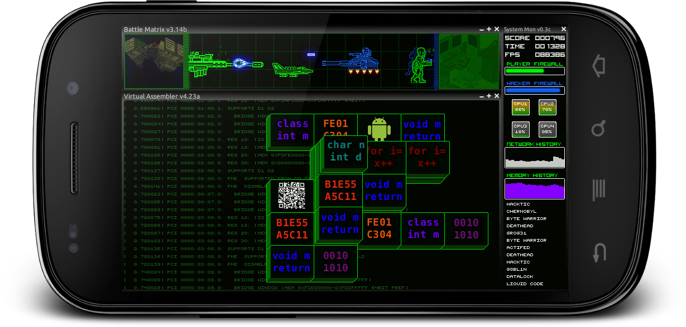

# RF-2D-Engine-Android
The is the base rendering engine used in my 2D Android games

## FSM
Among other things this code contains a good example of a Finite-state Machine. While there are many of those around the web, this one is a wee bit special, though I am certain not unique. The difference here is that while only one state can be active at a time, the previous state(s) are still there and being rendered just not updated. What on earth does that mean? Here is what is going on. The FSM in this case is just a FILO stack. This stack contains a list of screens or scenes in the game that need to be rendered and used. All items in the stack are rendered, but only the top item is updated and therefore accepts user input. Which is how your state is controlled. 

In other words... when the game starts up you push your main menu screen on to the stack so it gets rendered and updated. From that menu you select "Start" to start the game. At this point the main menu is no longer needed so you pop that off the stack then push the game screen onto the stack. Now the game screen is being rendered and updated. Nothing too special so far... but now you want to paused the game and bring up the pause menu. Which is all fine and dandy, but you also don't want the game have to restart. To do this you simply push the pause menu screen on to the stack. Now the Pause menu is the first item in the stack(remember FILO) and the game screen is the second. This results in the game being in the background and rendered, but not updated. So basically it is paused. The pause menu is now in the foreground. From the pause menu you open up the settings screen. So again just push the settings screen onto the stack. Now the pause menu, like the game screen, moves to the background so that it is being rendered but not updated. As a side note I like to fade them out a bit when they are in the background so that my screen is not overly cluttered, but that is not really relevant here.

Okay, so now the settings screen is first and foremost so it is being rendered and accepting input. Once you are done adjusting the settings you exit the screen. In the code you simply pop the setting screen from the stack so control goes back to the pause menu. When you exit the pause menu by popping it from the stack control goes back to the game screen as if you never left. This is really useful for opening multiple windows or screens within your game and keeping control of them. 

## Sprite Animations
There is also a good example of code for playing sprite animations. This is where your artwork is broken into frames and you need to render them in a certain order to create animation. You can then play the animation forward, backward, in a loop, or ping pong it back and forth. This example also shows you how to play that animation at a given speed regardless of frame rate. 

## Texture Font
You will find a workable example of how to render words on the screen when your font is in a texture. 
 
## Screenshots

